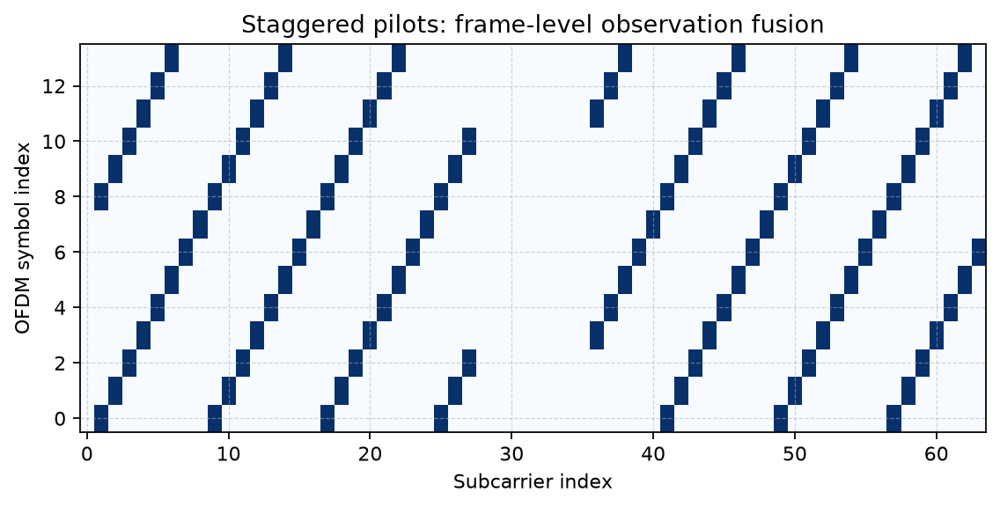
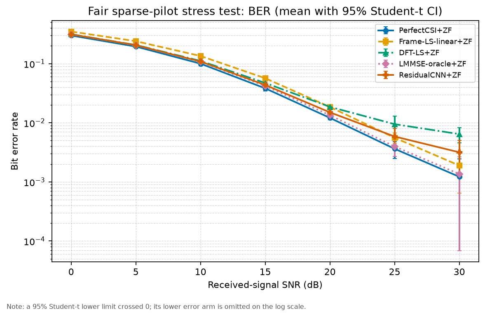
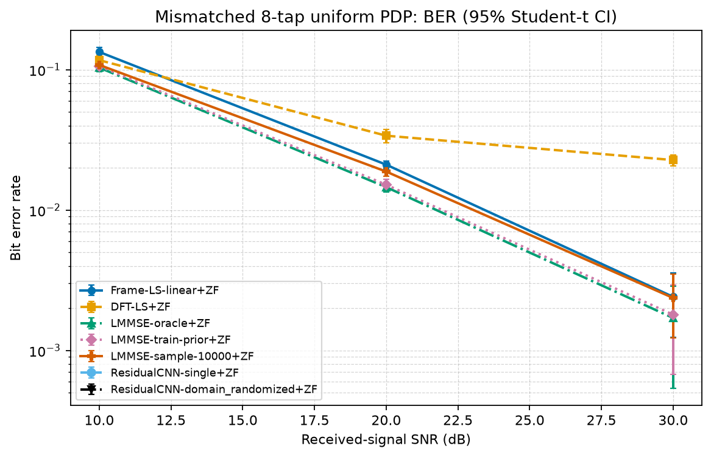
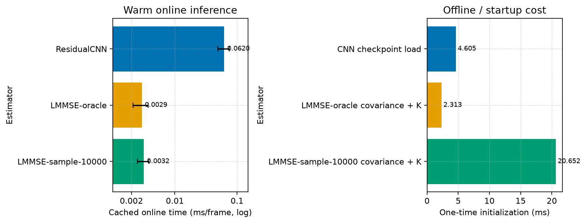

# Deep Learning-Aided OFDM Channel Estimation

[中文版](README.zh-CN.md) | [Editable Chinese report](report.md) | [Final report PDF](report.pdf) | [Experiment digest](results/final/experiment_summary.md)

A reproducible NumPy/PyTorch study of a **deep-learning-aided channel-estimation component** in a conventional OFDM receiver. It is not an end-to-end learned receiver. Every method uses the same bits, block-fading channel, AWGN realization, pilot observations, and test frames.

## System Model

```text
bits -> QAM -> pilot/data/guard/DC mapping -> unitary IFFT + CP
-> Rayleigh block-fading FIR + AWGN -> CP removal + unitary FFT
-> channel estimation -> one-tap ZF/MMSE -> hard demapping -> BER/SER/EVM
```

`Y[k] = H[k]X[k] + W[k]`, with unitary scaling `ifft(X)*sqrt(N)` and `fft(y)/sqrt(N)`. Each Rayleigh realization has `sum_l |h[l]|^2 = 1`; configuration enforces `channel_taps <= cp_length`.

SNR is consistently defined after the multipath channel:

```text
noise_power = mean(abs(channel_output)^2) / 10^(SNR_dB / 10)
```

Training, validation, and evaluation share this frame-generation path. This SNR is not directly `Eb/N0`.

## Methods

- Perfect CSI, per-symbol LS, Frame-LS, and finite-delay DFT-LS.
- Oracle LMMSE, train-prior LMMSE, and sample-covariance LMMSE using 100/1,000/10,000 historical channels.
- Residual 1-D CNN: plain, residual, hard delay projection, soft delay regularization, and domain-randomized training.

For fixed pilot pattern, PDP, channel length, and SNR, LMMSE caches:

```text
K = R_hp @ inv(R_pp + noise_cov)  # offline
H_hat = K @ H_LS                  # online
```

The inverse is never recomputed per frame. ZF and de-biased MMSE hard decisions can coincide in this uncoded one-tap link for a fixed channel estimate; this is expected.

## Staggered Pilot Setup

The formal configuration has FFT 64, 14 OFDM symbols, 8 guard tones, one DC null, and 55 active subcarriers. Each symbol has 6-7 pilots. A frame has 97 pilot observations, 12.60% pilot overhead, 100% active-subcarrier union coverage, and 1-2 observations per active subcarrier (mean 1.764).

This is a **frame-level observation-fusion and channel-denoising** experiment with sparse single-symbol pilots, not a pure interpolation problem. Frame-LS, DFT-LS, LMMSE, and CNN use the same frame-level pilot information.



## Results and Conclusions

All figures and tables are generated from the current CSV files in `results/final/`. BER plots use a logarithmic axis and show mean with 95% Student-t confidence intervals. When a finite-sample lower confidence limit is non-positive, its lower arm is omitted rather than being misleadingly drawn down to an arbitrary positive plotting floor. To regenerate figures only, without retraining or rerunning simulation:

```bash
python scripts/regenerate_result_figures.py --results-dir results/final
```

At 20 dB in the matched 12-tap exponential-PDP case:

| Receiver | BER (mean +/- 95% Student-t CI) | Channel NMSE (mean +/- 95% Student-t CI) |
| --- | --- | --- |
| Perfect CSI + ZF | `1.2100e-02 +/- 8.69e-04` | `0` |
| Frame-LS-linear + ZF | `1.8493e-02 +/- 6.19e-04` | `4.7356e-02 +/- 7.67e-03` |
| DFT-LS + ZF | `1.8577e-02 +/- 7.14e-04` | `3.4018e-02 +/- 6.48e-03` |
| Oracle LMMSE + ZF | `1.3400e-02 +/- 1.01e-03` | `2.0500e-03 +/- 3.81e-04` |
| Residual CNN + ZF | `1.4991e-02 +/- 1.54e-03` | `1.1124e-02 +/- 4.39e-04` |

Three independently trained CNNs are evaluated on the same three fixed test streams. CNN intervals use Student-t across **model/training seeds**; conventional-method intervals use Student-t across **test Monte Carlo seeds**. The raw outputs are kept separately.

Practical LMMSE with 10,000 historical channels has BER `1.6481e-02` at 20 dB matched and `1.8803e-02` under 8-tap uniform-PDP mismatch. The single-distribution CNN has `1.8857e-02` and `2.7710e-02`; domain randomization improves the mismatch CNN to `2.4661e-02`, but does not beat practical LMMSE in either case. On the unseen steep exponential-PDP case, the single CNN has slightly lower BER than practical LMMSE but higher NMSE; their CIs summarize different uncertainty layers and do not establish general superiority.

Hard delay projection lowers overall NMSE, but does not yield a separable BER gain and increases deep-fade NMSE. The supported conclusion is conditional: CNN can improve weak LS-like baselines in some settings but does not beat oracle LMMSE. Practical LMMSE is stronger in the matched and 8-tap uniform experiments; on the unseen steep exponential-PDP case, the single CNN has slightly lower BER but higher NMSE. Its model-seed CI and LMMSE test-seed CI are different uncertainty layers, so that point does not support a general superiority claim.





## Complexity

The formal CPU benchmark uses batch 64, five warm-ups, and 15 repeated measurements. Its host-dependent current values, including covariance construction, cached `K` construction, checkpoint loading, online mean/std, parameter count, MAC estimate, and memory/storage, are emitted to `results/final/multiseed/complexity_benchmark.csv` and summarized in the report. The CNN has 25,858 parameters, roughly 1.64M convolution MACs/frame, and a 113,183-byte checkpoint.



## Layout

```text
configs/                         Experiment configurations
src/                             OFDM link, estimators, dataset, CNN, training, evaluation
scripts/run_full_experiment.py   Formal train/evaluate/report workflow
scripts/run_multiseed_experiment.py
scripts/run_ablation.py
tests/                           Unit and audit tests
results/final/                   Current CSVs, figures, manifests, and digest
checkpoints/                     Independent-training-seed checkpoints
```

## Install and Run

```powershell
pip install -r requirements.txt
python -m pytest tests/
```

Quick verification:

```powershell
python scripts/run_full_experiment.py --config configs/quick_experiment.json --mismatch-config configs/mismatch_config.json --multiseed-config configs/quick_experiment.json --domain-config configs/domain_randomized_quick_config.json --checkpoint checkpoints/quick_full.pt --results-dir results/quick --skip-report
```

Formal experiment and report:

```powershell
python scripts/run_full_experiment.py
```

Reuse validated checkpoints while regenerating artifacts:

```powershell
python scripts/run_full_experiment.py --skip-train
```

## Limits

The model assumes perfect synchronization and frame-static fading. CFO, phase noise, Doppler, IQ imbalance, RF nonlinearity, and channel coding are outside the present scope.
