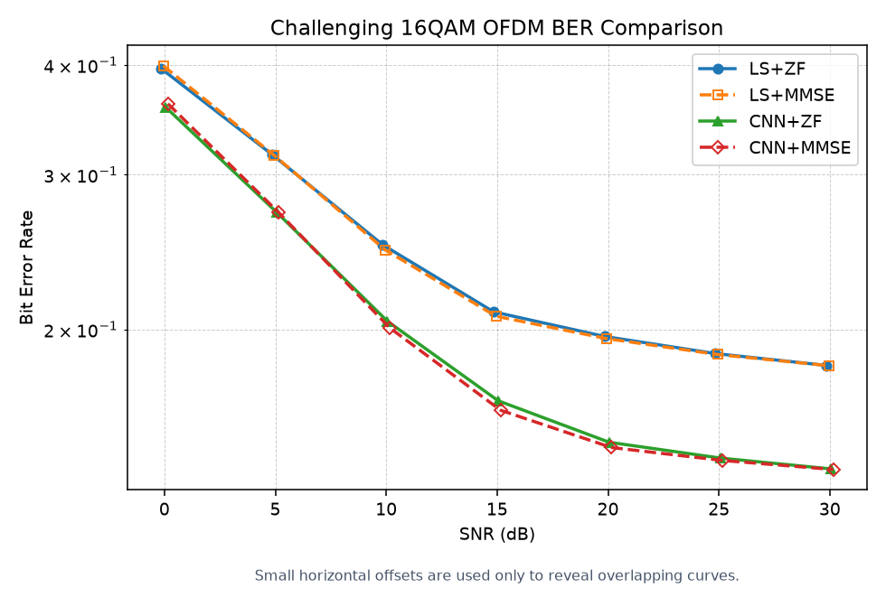
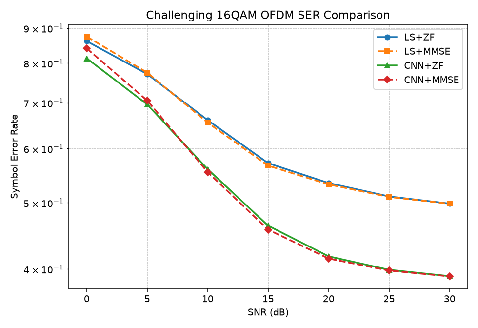
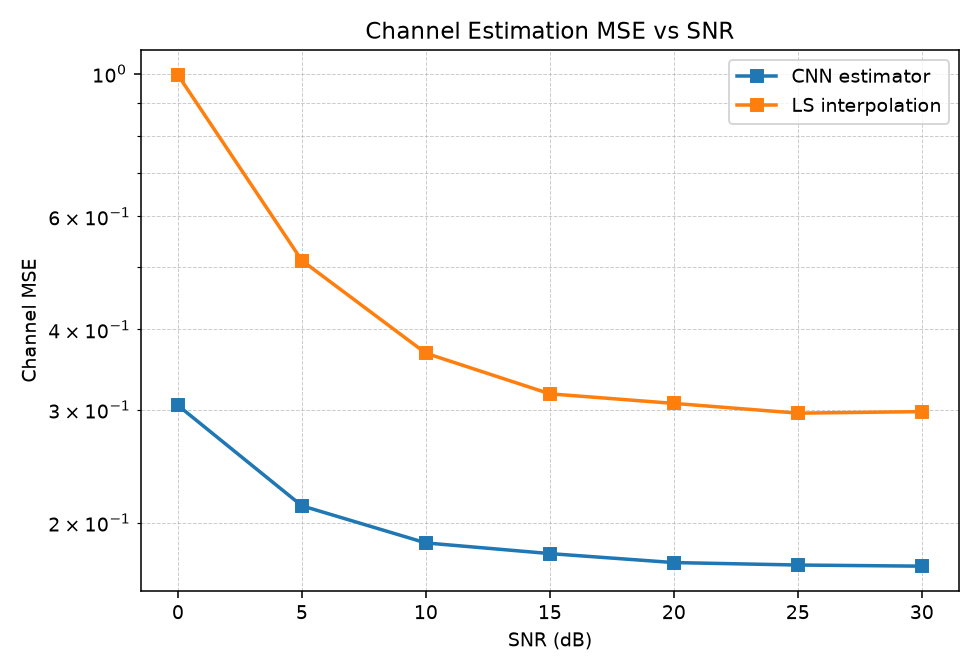
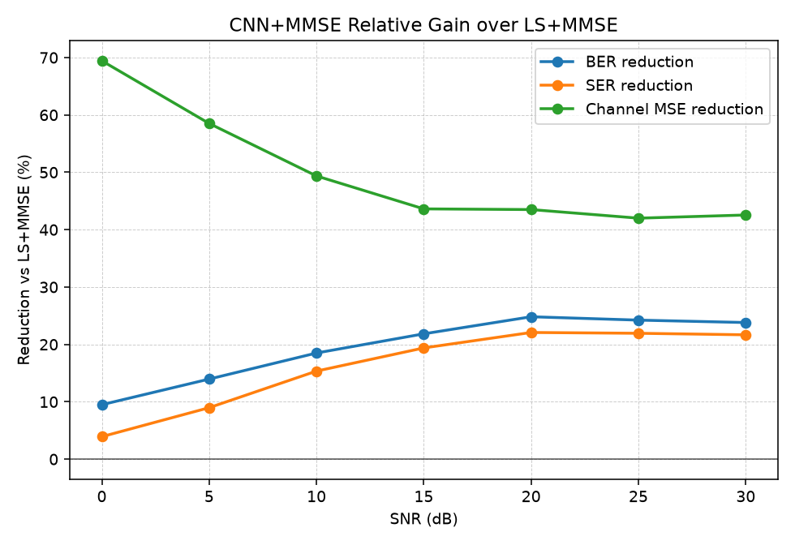
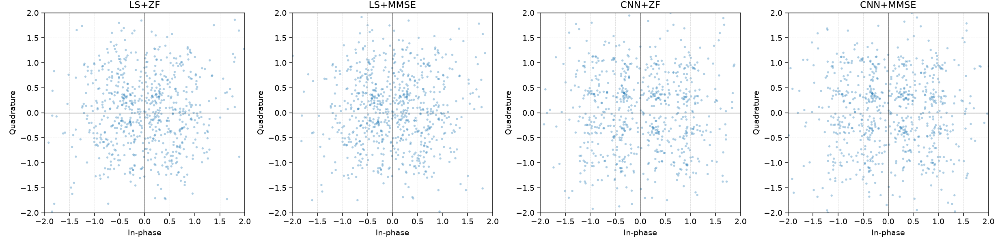

# 基于深度学习的 OFDM 接收机

[English README](README.md)

本项目实现了一个可复现、可运行的 OFDM 通信系统仿真平台，用于比较传统 pilot-based 接收机和 CNN 深度学习信道估计接收机的性能。项目不是单个 notebook，而是一个完整的 Python 研究型代码仓库，包含系统建模、传统算法、深度学习模型、训练脚本、评估脚本、测试和结果可视化。

项目名称：`Deep Learning Based OFDM Receiver`

## 项目背景

OFDM（Orthogonal Frequency Division Multiplexing，正交频分复用）是现代无线通信系统中的核心技术，广泛应用于 Wi-Fi、LTE、5G NR 等系统。它通过把宽带频率选择性信道划分为多个窄带子载波，使复杂的多径信道均衡问题转化为每个子载波上的单抽头均衡问题。

传统 OFDM 接收机通常依赖导频符号进行信道估计，例如：

- 在 pilot 子载波上使用 LS（Least Squares）估计信道；
- 在频域上对非 pilot 子载波进行插值；
- 使用 ZF（Zero Forcing）或 MMSE（Minimum Mean Square Error）均衡恢复发送符号。

近年来，深度学习方法被用于改进无线接收机中的部分模块。本项目采用一种较稳妥的 hybrid receiver 设计：不直接端到端替代整个接收机，而是让 CNN 学习从稀疏 pilot LS 估计恢复完整频域信道响应，再使用标准 ZF/MMSE 均衡和硬判决解调。

## 系统模型

默认 OFDM 参数如下：

| 参数 | 默认值 |
| --- | --- |
| 子载波数 | `N = 64` |
| 循环前缀长度 | `CP = 16` |
| 每帧 OFDM 符号数 | `T = 14` |
| 调制方式 | QPSK |
| pilot 类型 | comb-type pilots |
| pilot 间隔 | 每 4 个子载波一个 pilot |
| pilot 符号 | 已知 QPSK 符号 |
| 信道模型 | 频率选择性 Rayleigh 多径信道 |
| 信道抽头数 | `8` |
| 评估 SNR | `0, 5, 10, 15, 20, 25, 30 dB` |

发送端流程：

1. 生成随机 bit；
2. 将 bit 映射为 QPSK 符号；
3. 在频域 OFDM 网格中插入 pilot；
4. 对每个 OFDM 符号执行 IFFT；
5. 添加循环前缀；
6. 串行化为时域发送波形。

信道模型为有限长复高斯 Rayleigh 多径信道：

```text
y[n] = sum_l h[l] x[n-l] + w[n]
```

每个信道 realization 都归一化为：

```text
sum_l |h[l]|^2 = 1
```

接收端流程：

1. 移除循环前缀；
2. 执行 FFT 回到频域；
3. 根据 pilot 估计信道；
4. 对数据子载波进行均衡；
5. 对均衡后的符号进行 QPSK 硬判决；
6. 计算 BER。

### SNR 定义

本项目统一使用经验接收信号功率定义 SNR。先对经过多径信道后的时域信号计算平均功率，再按目标 SNR 加 AWGN：

```text
signal_power = mean(|channel_output|^2)
noise_power = signal_power / 10^(SNR_dB / 10)
```

训练和评估均调用同一个数据生成路径，因此 SNR 定义保持一致。

## 传统 baseline

本项目实现了两个传统 OFDM 接收机 baseline。

### LS 信道估计 + 频域插值

在 pilot 子载波位置，LS 信道估计为：

```text
H_LS[k] = Y[k] / X[k]
```

其中：

- `Y[k]` 是接收端频域符号；
- `X[k]` 是已知 pilot 符号；
- `H_LS[k]` 是 pilot 位置的信道估计。

非 pilot 子载波上的信道响应通过线性插值得到。实现中对实部和虚部分别插值。

### ZF 均衡

ZF 均衡直接除以信道估计：

```text
X_hat[k] = Y[k] / H_hat[k]
```

ZF 简单直观，但当 `|H_hat[k]|` 很小时会放大噪声。

### MMSE 均衡

MMSE 均衡考虑噪声方差：

```text
X_hat[k] = conj(H_hat[k]) Y[k] / (|H_hat[k]|^2 + noise_var)
```

在本项目中，QPSK 采用单位平均功率归一化。由于 OFDM 的 IFFT/FFT 使用 unitary normalization，时域 AWGN 方差在频域保持一致，因此脚本中生成的 `noise_var` 可以直接用于 MMSE 均衡。

## 深度学习方法

深度学习部分实现了一个 CNN-based channel estimator。它不直接输出 bit，而是估计完整的频域信道响应。

### CNN 输入

输入张量形状为：

```text
[B, 3, T, N]
```

其中：

- `B`：batch size；
- `T`：每帧 OFDM 符号数；
- `N`：子载波数；
- channel 0：稀疏 LS 信道估计的实部，非 pilot 位置为 0；
- channel 1：稀疏 LS 信道估计的虚部，非 pilot 位置为 0；
- channel 2：pilot mask，pilot 位置为 1，其他位置为 0。

### CNN 输出

输出张量形状为：

```text
[B, 2, T, N]
```

其中：

- output channel 0：完整频域信道响应实部；
- output channel 1：完整频域信道响应虚部。

### 训练目标和 loss

训练目标是真实频域信道响应 `H`。由于当前版本假设一帧内信道不随 OFDM 符号变化，因此真实信道响应会在 `T` 个 OFDM 符号上重复。

loss 为实部和虚部上的均方误差：

```text
Loss = MSE(Re(H_pred), Re(H_true)) + MSE(Im(H_pred), Im(H_true))
```

训练完成后，CNN 估计出的信道可分别接入：

- CNN + ZF；
- CNN + MMSE。

## 实验设置

### 环境安装

推荐 Python 3.10 或更高版本。

```bash
pip install -r requirements.txt
```

主要依赖：

- `numpy`
- `scipy`
- `matplotlib`
- `torch`
- `tqdm`
- `pandas`
- `pytest`

### 运行传统 baseline

```bash
python scripts/run_baseline.py
```

快速评估：

```bash
python scripts/run_baseline.py --num-test-frames 200
```

输出文件：

- `results/baseline_ber.csv`
- `results/baseline_ber_vs_snr.png`

### 训练 CNN 接收机组件

默认训练：

```bash
python scripts/train_cnn_receiver.py
```

CPU 快速演示：

```bash
python scripts/train_cnn_receiver.py --epochs 2 --num-train-samples 1000 --num-val-samples 200
```

常用参数：

```bash
python scripts/train_cnn_receiver.py \
  --epochs 10 \
  --batch-size 64 \
  --learning-rate 1e-3 \
  --device auto \
  --num-train-samples 5000 \
  --num-val-samples 1000
```

输出文件：

- `checkpoints/cnn_channel_estimator.pt`
- `results/training_history.csv`
- `results/training_loss.png`

### 评估所有方法

```bash
python scripts/evaluate_all.py
```

快速评估：

```bash
python scripts/evaluate_all.py --num-test-frames 200
```

输出文件：

- `results/ber_comparison.csv`
- `results/ber_comparison.png`
- `results/ser_comparison.png`
- `results/evm_vs_snr.png`
- `results/cnn_gain_vs_snr.png`
- `results/channel_mse.csv`
- `results/channel_mse_vs_snr.png`
- `results/constellation_example.png`

### 运行凸显 CNN 优势的 challenging 实验

默认 QPSK、pilot spacing 为 4 的设置主要用于验证链路是否正确。为了更清楚地体现 CNN 信道估计器的优势，本项目新增了一个更困难的实验配置：

```text
configs/challenging_config.json
```

该配置使用：

- 16QAM；
- pilot spacing = 8，即 pilot 更稀疏；
- Rayleigh 信道抽头数 = 12，即频率选择性更强；
- 相同的 SNR 范围：0 到 30 dB。

一条命令训练并评估：

```bash
python scripts/run_challenging_experiment.py
```

如果已有 checkpoint，只重新评估：

```bash
python scripts/run_challenging_experiment.py --num-test-frames 500
```

强制重新训练：

```bash
python scripts/run_challenging_experiment.py --force-train
```

输出文件位于：

```text
results/challenging/
```

### 测试

```bash
pytest tests/
```

如果 Windows 终端找不到 `pytest` 命令，可使用：

```bash
python -m pytest tests/
```

当前测试覆盖：

- QPSK 调制和解调无噪声往返；
- 16QAM 调制和解调无噪声往返；
- OFDM identity channel、无噪声 BER 为 0；
- Dataset 输出 shape；
- CNN 输入输出 shape；
- Rayleigh 信道归一化。

## 结果图

仓库中随附的可视化结果位于 `results/challenging/`，对应下文的 16QAM、稀疏 pilot、12-tap Rayleigh 信道实验。

如果你在图中看到曲线数量少于图例数量，这通常不是因为没有训练，而是因为某些方法的 BER 数值完全重合。当前图中对 BER 曲线加入了很小的横向偏移，仅用于显示重合曲线；CSV 中的真实 SNR 数值没有改变。

## 凸显 CNN 优势的实验

仅在默认 QPSK 场景下观察 BER，不足以强有力说明 CNN 更有效。原因是 QPSK 判决区域较粗，pilot 也比较密，传统 LS 线性插值已经能取得不错结果。因此本项目新增 challenging setting 来放大信道估计误差对通信性能的影响。

### Challenging setting

| 项目 | 默认实验 | Challenging 实验 |
| --- | --- | --- |
| 调制方式 | QPSK | 16QAM |
| pilot spacing | 4 | 8 |
| 每个 OFDM 符号 pilot 数 | 16 | 8 |
| 信道抽头数 | 8 | 12 |
| 目标 | 验证链路正确性 | 凸显信道估计能力差异 |

这个设置下，16QAM 对幅度和相位误差更敏感，pilot 更稀疏导致 LS 插值更困难，12 抽头信道带来更强频率选择性。因此如果 CNN 能学到多径信道的频域结构，它的优势会更明显。

### Challenging BER 对比



### Challenging SER 对比



### Challenging 信道 MSE 对比



### CNN 相对 LS 的提升比例



### Challenging 星座图



### Challenging 结果摘要

下表来自 `results/challenging/ber_comparison.csv`，比较的是更困难的 16QAM、pilot spacing = 8、12-tap Rayleigh 信道场景。

| SNR (dB) | LS+MMSE BER | CNN+MMSE BER | BER 降低 | LS channel MSE | CNN channel MSE | MSE 降低 |
| --- | --- | --- | --- | --- | --- | --- |
| 0 | 0.3990 | 0.3611 | 9.5% | 0.9962 | 0.3045 | 69.4% |
| 10 | 0.2463 | 0.2007 | 18.5% | 0.3671 | 0.1859 | 49.4% |
| 20 | 0.1951 | 0.1467 | 24.8% | 0.3067 | 0.1732 | 43.5% |
| 30 | 0.1818 | 0.1385 | 23.8% | 0.2977 | 0.1710 | 42.6% |

这个结果比默认 QPSK 实验更能说明 CNN 的作用：在 pilot 稀疏且调制阶数更高时，CNN 信道估计器相比简单 LS 线性插值能更好恢复频域信道结构，从而降低 BER、SER 和 channel MSE。

EVM 图也被保存到 `results/challenging/evm_vs_snr.png`。需要注意，当前 MMSE 均衡公式是标准线性 MMSE 形式，其输出带有幅度偏置；对 16QAM 硬判决来说，EVM 和 BER 不一定完全同向。因此本项目主要用 BER、SER 和 channel MSE 判断 CNN 信道估计器的收益。

## 结论

从当前实验可以观察到：

1. 所有接收机的 BER 随 SNR 增大整体下降，说明 OFDM 链路、信道模型和噪声模型基本正确。
2. 默认 QPSK 实验可以说明 CNN 方法可行，但不是最强的优势证明，因为 QPSK 判决较粗且 pilot 较密。
3. 在 16QAM、pilot spacing = 8、12-tap Rayleigh 信道的 challenging setting 下，CNN+MMSE 相比 LS+MMSE 在 20 dB 处 BER 降低约 24.8%，SER 降低约 22.1%，channel MSE 降低约 43.5%。
4. CNN 的主要优势来自学习信道频域结构，而不是替代整个接收机。它作为 channel estimator component 与传统均衡器组合，仍保留较好的可解释性。
5. 当前结论应严格表述为：CNN 信道估计器在本项目构造的稀疏 pilot、高阶调制、频率选择性信道场景下优于简单 LS 线性插值 baseline。它还不能代表 CNN 一定优于所有传统接收机，例如 LMMSE、DFT-denoising 或 spline interpolation。

## 自己的改进点

相比一个最小化 OFDM 仿真，本项目做了以下改进：

1. 使用完整工程结构，而不是只写 notebook，便于复现实验和扩展。
2. 统一训练和评估的数据生成路径，避免 SNR 定义或信道模型不一致。
3. 使用 unitary IFFT/FFT 归一化，使时域和频域噪声方差解释更清晰。
4. 在代码中显式区分 pilot mask 和 data mask，降低导频泄漏到数据评估中的风险。
5. CNN 输入不仅包含 sparse LS 的实部和虚部，还加入 pilot mask，让模型明确知道哪些位置是观测值。
6. 新增 16QAM、稀疏 pilot、12-tap 信道的 challenging 实验，专门用于凸显 CNN 相比 LS 插值的优势。
7. 同时输出 BER、SER、EVM、channel MSE、相对提升比例和 constellation 图，便于从通信性能和估计质量多个角度分析模型。
8. 增加 pytest 测试，覆盖 QPSK、16QAM、OFDM 无噪声链路、shape 和信道归一化。
9. 提供快速训练、快速评估和 challenging 一键实验脚本，CPU 环境也可以完成端到端演示。
10. 没有使用 Sionna、MATLAB 等外部通信库，OFDM、信道、估计、均衡和 demapping 均由 NumPy/PyTorch 实现，便于学习底层原理。

## 局限性

当前版本仍有以下限制：

- 假设完美同步，没有 timing offset；
- 没有 CFO（carrier frequency offset）；
- 没有 phase noise；
- 没有 Doppler 和帧内时变信道；
- 没有 IQ imbalance、PA nonlinear distortion 等硬件损伤；
- 信道模型为合成 Rayleigh FIR 信道；
- CNN 架构较简单，训练轮数较少时性能不稳定；
- 16QAM 已加入 challenging 实验，但尚未系统扩展到 64QAM 或编码链路。

## 未来工作

可以继续扩展：

- 加入时变信道和 Doppler；
- 加入 CFO、phase noise 和 IQ imbalance；
- 增加 16QAM、64QAM 下的系统性评估；
- 引入 soft demapping 和 coded BER/BLER；
- 使用 transformer 或 U-Net 结构做信道估计；
- 比较 CNN 在 channel mismatch 条件下的泛化能力；
- 增加 Monte Carlo 置信区间；
- 实现端到端 learned receiver，与模块化接收机进行对比。

## 项目结构

```text
.
|-- README.md
|-- README.zh-CN.md
|-- requirements.txt
|-- report.pdf
|-- configs/
|   |-- default_config.json
|   `-- challenging_config.json
|-- data/
|-- src/
|   |-- channel.py
|   |-- config.py
|   |-- dataset.py
|   |-- estimators.py
|   |-- evaluate.py
|   |-- models.py
|   |-- modulation.py
|   |-- ofdm.py
|   |-- plots.py
|   |-- train.py
|   `-- utils.py
|-- scripts/
|   |-- run_baseline.py
|   |-- train_cnn_receiver.py
|   |-- evaluate_all.py
|   |-- run_challenging_experiment.py
|   `-- build_readme_pdf.py
|-- tests/
|-- notebooks/
`-- results/
    `-- challenging/
```
