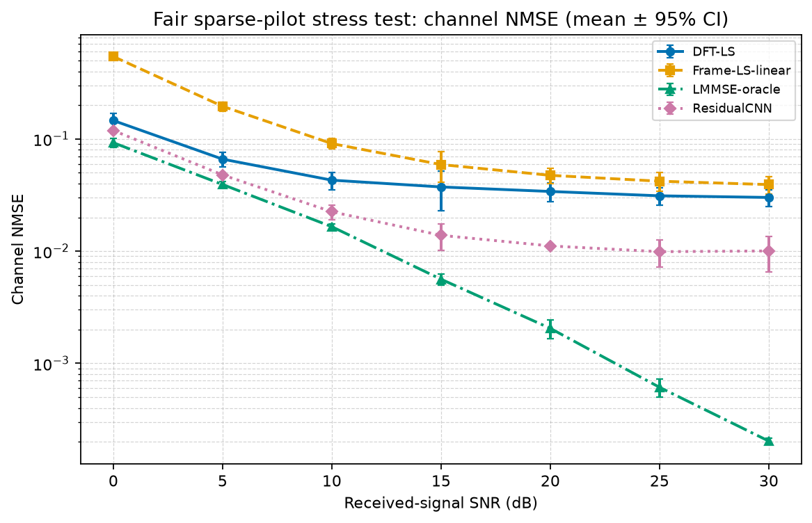
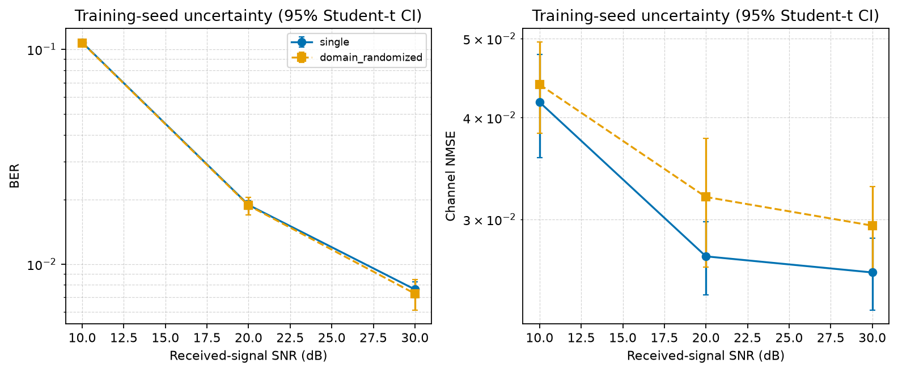
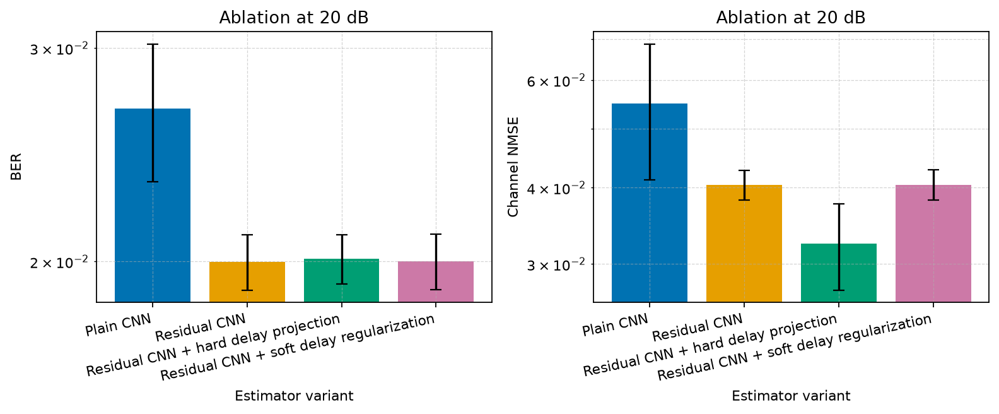

# 深度学习辅助的 OFDM 信道估计

[English README](README.md) | [可编辑中文报告](report.md) | [最终报告 PDF](report.pdf) | [由 CSV 自动生成的实验摘要](results/final/experiment_summary.md)

这是一个可复现的 NumPy/PyTorch 研究型工程：在传统 OFDM 接收机中，将深度学习限定为**信道估计辅助模块**，而不是端到端 learned receiver。所有传统基线与 CNN 对每一帧使用完全相同的发送比特、信道 realization、AWGN realization、导频观测和测试帧。

## 项目背景与目标

OFDM 将频率选择性多径信道分解为多个近似平坦的子载波，是 Wi-Fi、LTE 和 5G NR 的核心技术。传统接收机通常依赖导频 LS 估计、插值与均衡；深度学习可能在统计先验不完备或模型失配时作为信道估计模块提供额外的去噪与融合能力。

本项目不预设 CNN 一定获胜，而是以相同信息量和同一组随机 realization 为前提，审计比较简单 LS、DFT-LS、oracle LMMSE、有限历史样本的 practical LMMSE 与轻量残差 CNN。

## 系统模型

```text
bits -> QAM -> pilot/data/guard/DC mapping -> unitary IFFT + CP
-> block Rayleigh FIR + AWGN -> CP removal + unitary FFT
-> channel estimation -> one-tap ZF/MMSE -> hard demapping -> BER/SER/EVM
```

频域模型为 `Y[k] = H[k]X[k] + W[k]`。工程使用 unitary OFDM 归一化：`ifft(X)*sqrt(N)` 和 `fft(y)/sqrt(N)`。每个 Rayleigh 信道 realization 都被归一化为 `sum_l |h[l]|^2 = 1`，且配置强制 `channel_taps <= cp_length`。

SNR 统一按经过多径信道后的经验接收功率定义：

```text
noise_power = mean(abs(channel_output)^2) / 10^(SNR_dB / 10)
```

训练、验证和评测共用同一帧生成路径和 SNR 定义。该 SNR 不是直接的 `Eb/N0`；若需要换算，还应考虑调制阶数以及导频/guard 开销。

## 传统 Baseline

- `PerfectCSI`：已知真实频域信道的性能参考上界。
- `LS` / `Frame-LS`：导频位置 `H_LS = Y_p / X_p`；Frame-LS 先融合帧内重复观测，再插值。
- `DFT-LS`：将帧级 LS 变换到时延域，仅保留配置的有效 tap 支持。
- `LMMSE-oracle` 与 `LMMSE-train-prior`：分别使用真实 PDP 与预设训练分布先验。
- `LMMSE-sample-{100,1000,10000}`：用有限历史信道样本估计均值/协方差，并使用 diagonal loading 与最小特征值截断正则化。

缓存 LMMSE 的离线与在线过程明确分离：

```text
K = R_hp @ inv(R_pp + noise_cov)  # 离线：固定配置时缓存
H_hat = K @ H_LS                  # 在线：每帧仅矩阵-向量乘
```

ZF 为 `Y/H_hat`。MMSE 输出在硬 QAM 判决前去除幅度偏置；在本项目未编码单抽头模型中，对于同一 `H_hat`，去偏后的 MMSE 与 ZF 硬判决可能重合，这是正确的通信结论。

## 深度学习方法

`ResidualCNNChannelEstimator` 是轻量一维残差 CNN。输入由帧级线性 LS、稀疏 LS 与导频并集 mask 的实/虚部构成；网络使用 circular dilated residual blocks 预测线性 LS 的残差。项目比较 Plain CNN、Residual CNN、hard delay projection、soft delay regularization，以及单一分布与 domain-randomized training。

hard delay projection 的有效 tap indexing、训练/验证/测试随机流独立性、checkpoint 不互相覆盖等均有自动化测试覆盖。

## 实验设置与导频含义

正式压力测试使用 FFT=64、CP=16、14 个 OFDM 符号、16QAM、两侧 8 个 guard、1 个 DC null、12-tap 指数 PDP。每符号有 6--7 个 staggered comb pilot；整帧有 97 个 pilot observation，pilot overhead 为 12.60%。55 个有效子载波在整帧的 pilot 并集覆盖率为 100%，每个有效子载波平均直接观测 1.764 次，范围为 1--2 次。

因此应将此场景准确表述为：**单符号稀疏 pilot、块衰落条件下的帧级观测融合和信道去噪实验**。Frame-LS、DFT-LS、LMMSE 和 CNN 均利用相同的帧级导频信息，不存在 CNN 获得额外观测的情况。


## 结果图

所有图和表均由 `results/final/` 的当前 CSV 自动生成。BER 使用对数坐标，图中展示均值和置信区间。









## 核心结论

### 20 dB 匹配主结果

下表是单一正式 checkpoint 在 3 个独立测试 seed、每个 seed 100 帧下的结果；95% CI 采用 Student-t。

| 方法 | BER（均值 +/- 95% CI） | Channel NMSE（均值 +/- 95% CI） |
| --- | --- | --- |
| PerfectCSI + ZF | `1.2100e-02 +/- 8.69e-04` | `0` |
| Frame-LS-linear + ZF | `1.8493e-02 +/- 6.19e-04` | `4.7356e-02 +/- 7.67e-03` |
| DFT-LS + ZF | `1.8577e-02 +/- 7.14e-04` | `3.4018e-02 +/- 6.48e-03` |
| Oracle LMMSE + ZF | `1.3400e-02 +/- 1.01e-03` | `2.0500e-03 +/- 3.81e-04` |
| Residual CNN + ZF | `1.4991e-02 +/- 1.54e-03` | `1.1124e-02 +/- 4.39e-04` |

### 多训练 seed 与置信区间

多模型实验训练了 3 个相互独立的 CNN：独立初始化、训练样本、验证样本和 checkpoint。每个模型均在同一组固定 3 个测试 seed（每个 60 帧）上评估，并在 10/20/30 dB 汇总。CNN 的 CI 是跨**模型训练 seed**的 Student-t 95% CI；传统方法的 CI 是跨**测试 Monte Carlo seed**的 Student-t 95% CI。两者分开保存，不能把测试 seed 当作独立训练次数。

### CNN 是否更有效

1. 相对简单 LS：CNN 在部分匹配工作点优于 Frame-LS/DFT-LS，但并非所有 SNR 都有增益。
2. 相对 oracle LMMSE：否。已知真实 PDP 的 oracle LMMSE 更强，这是合理的强基线。
3. 相对 practical LMMSE：20 dB 匹配时，10,000 历史信道样本的 sample-covariance LMMSE BER 为 `1.6481e-02`，低于单一训练分布 CNN 的 `1.8857e-02`。
4. 统计失配：8-tap uniform PDP 下，domain-randomized CNN 将 BER 从 `2.7710e-02` 降为 `2.4661e-02`，但 practical LMMSE 仍为 `1.8803e-02`。在未见 10-tap 陡峭指数 PDP 下，single CNN BER 略低于 practical LMMSE，但 NMSE 更高；domain-randomized CNN 反而不如 single CNN。由于 CNN 和 LMMSE 的 CI 分别基于模型 seed 与测试 seed，不能据此宣称普遍优势。
5. delay prior：hard projection 将总体 NMSE 从 `4.0473e-02` 降到 `3.2435e-02`，但 BER 从 `1.9999e-02` 变为 `2.0096e-02`，区间重叠且 deep-fade NMSE 变差。因此不能用总体 NMSE 的改善宣称 BER 也改善。

这不是项目失败，而是一个可审计的工程结论：在匹配与 8-tap uniform 失配场景，缓存后的 practical LMMSE 更快且 BER/NMSE 更低；在未见 10-tap 陡峭指数 PDP 中，single CNN 的 BER 略低于 practical LMMSE、但 NMSE 更高。两者的 CI 分别来自模型 seed 与测试 seed，不能据此宣称 CNN 普遍更优；CNN 的收益只在部分弱基线或特定失配下出现。

## 复杂度

统一 CPU benchmark 使用 batch=64、5 次 warm-up 和 15 次重复测量。协方差构建、缓存 K 构建、checkpoint 加载、在线均值/标准差、参数量、MAC 估计与存储开销均写入 `results/final/multiseed/complexity_benchmark.csv`，并在报告中自动汇总；计时数值随运行硬件而变化。CNN 共有 25,858 参数、约 1.64M MAC/帧、checkpoint 大小 113,183 B。


## 仓库结构

```text
configs/                         默认、quick、多 seed、domain-randomized 配置
src/                             OFDM、信道、估计器、数据集、CNN、训练与评估
scripts/run_full_experiment.py   一键正式实验与报告
scripts/run_multiseed_experiment.py
scripts/run_ablation.py
tests/                           单元测试与审计测试
results/final/                   本轮 CSV、图片、manifest 与实验摘要
checkpoints/                     独立训练 seed 的 checkpoint
```

## 安装与运行

建议 Python 3.10+：

```powershell
pip install -r requirements.txt
python -m pytest tests/
```

快速验证，包含较小样本的多 seed、消融、practical LMMSE 和 domain randomization：

```powershell
python scripts/run_full_experiment.py --config configs/quick_experiment.json --mismatch-config configs/mismatch_config.json --multiseed-config configs/quick_experiment.json --domain-config configs/domain_randomized_quick_config.json --checkpoint checkpoints/quick_full.pt --results-dir results/quick --skip-report
```

正式实验并更新 `report.md` 与 `report.pdf`：

```powershell
python scripts/run_full_experiment.py
```

重用已验证 checkpoint，仅重生成正式 CSV、图和报告：

```powershell
python scripts/run_full_experiment.py --skip-train
```

## 局限与未来工作

当前模型假设完美同步、帧内静态块衰落，未包括 CFO、相位噪声、Doppler、IQ imbalance、硬件非线性和信道编码。下一步应在不弱化传统基线的前提下，研究更复杂失配、时变信道、硬件非理想和编码链路，并继续报告 CNN 对强 statistics-based baseline 的真实差距。
