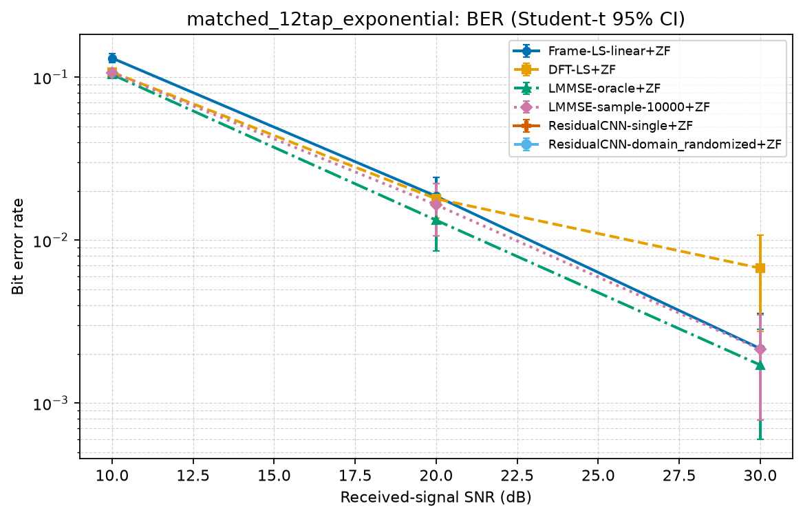

# 深度学习辅助的 OFDM 信道估计：公平基线、物理先验与泛化分析

英文标题：Deep Learning-Aided OFDM Channel Estimation: Fair Baselines, Physical Priors, and Generalization

## 1. 问题定位与可复现实验链路

本项目实现的是传统 OFDM 接收链路中的深度学习辅助信道估计模块，不是端到端 learned receiver。处理链路为：

```text
bits -> 16QAM -> pilot/data/guard/DC mapping -> unitary IFFT + CP
-> block Rayleigh FIR + AWGN -> CP removal + unitary FFT
-> channel estimation -> one-tap ZF/MMSE -> hard demapping -> BER/SER/EVM
```

频域模型为 `Y[k] = H[k]X[k] + W[k]`。IFFT 使用 `ifft(X)*sqrt(N)`，FFT 使用 `fft(x)/sqrt(N)`；每个 Rayleigh 信道 realization 都归一化到 `sum |h[l]|^2 = 1`，且 CP=16 不小于最大信道长度。SNR 始终按信道输出的经验平均功率定义：`noise_power = mean(|channel_output|^2) / 10^(SNR_dB/10)`。训练、验证和评测共用同一帧生成路径，因此这里的 SNR 不是直接的 Eb/N0。

正式压力测试采用 FFT=64、14 个 OFDM 符号、16QAM、两侧 8 个 guard、1 个 DC null、12-tap 指数 PDP，并在 0--30 dB 评估。每个方法在同一帧复用完全相同的比特、信道与 AWGN realization；没有为了 CNN 调整测试数据或弱化基线。

## 2. Staggered 导频的物理含义

每个符号仅有 6--7 个 pilot，帧内合计 97 个观测，导频开销为 12.60%。55 个有效子载波在整帧的 pilot 并集覆盖率为 100%，每个有效子载波平均被直接观测 1.764 次。

因此，这不是“所有子载波均未观测的纯频域插值”任务，而是单符号稀疏 pilot、块衰落条件下的帧级观测融合和信道去噪实验。Frame-LS 先合并重复观测再插值；DFT-LS 对该帧级估计做有限时延投影；LMMSE 对相同帧级 LS 向量使用统计滤波；CNN 以同一帧级 LS 与 mask 为输入。信息量对所有强基线和 CNN 一致。


## 3. 方法与统计口径

比较 Perfect CSI、Frame-LS、DFT-LS、oracle LMMSE、训练先验 LMMSE、sample-covariance LMMSE 与残差 1-D CNN。CNN 用 circular dilated residual blocks 从帧级线性 LS 预测频域残差；其 hard delay projection 在训练和推理均使用同一有效 tap 区间。MMSE 输出在硬判决前去除幅度偏置，因此在该未编码单抽头模型中，同一信道估计下 ZF 与 MMSE 判决可重合，这是预期现象。

主结果的 95% CI 是 3 个独立测试 Monte Carlo seed 的 Student-t 区间。多模型 CNN 的 95% CI 则是 3 个独立 training/model seed 的 Student-t 区间，且每个模型都在同一 3 个测试 seed、每个 seed 60 帧上评估。测试随机性和模型训练随机性分别保存，不能把 3 个测试 seed 误写成 3 次独立训练。

## 4. 匹配分布结果

以下为单一正式 checkpoint 在 3 个测试 seed、每个 seed 100 帧上的 20 dB 主结果。

| 方法 | BER (均值 +/- 95% CI) | 信道 NMSE (均值 +/- 95% CI) |
| --- | --- | --- |
| PerfectCSI+ZF | 1.2100e-02 +/- 8.69e-04 | 0.0000e+00 +/- 0.00e+00 |
| Frame-LS-linear+ZF | 1.8493e-02 +/- 6.19e-04 | 4.7356e-02 +/- 7.67e-03 |
| DFT-LS+ZF | 1.8577e-02 +/- 7.14e-04 | 3.4018e-02 +/- 6.48e-03 |
| LMMSE-oracle+ZF | 1.3400e-02 +/- 1.01e-03 | 2.0500e-03 +/- 3.81e-04 |
| ResidualCNN+ZF | 1.4991e-02 +/- 1.54e-03 | 1.1124e-02 +/- 4.39e-04 |


在匹配的可解析统计模型中，CNN 优于简单 Frame-LS/DFT-LS 的部分工作点，但不优于 oracle LMMSE；高 SNR 还出现模型误差地板。该结论与已知 PDP/时延支持时 LMMSE 可利用准确二阶统计先验相一致。

## 5. 多训练 seed、实用 LMMSE 与泛化

sample-covariance LMMSE 使用有限历史信道样本估计均值与频域协方差，再通过 diagonal loading 与最小特征值截断正则化。其线上仅执行缓存矩阵 `K @ H_LS`。历史先验均来自 12-tap 指数 PDP，未从测试帧拟合：

| 先验 | 来源 | 历史信道样本数 | 协方差构建 (ms) |
| --- | --- | --- | --- |
| LMMSE-oracle | analytic:exponential:12 | 0 | 1.917 |
| LMMSE-sample-100 | sample:exponential:12 | 100 | 1.390 |
| LMMSE-sample-1000 | sample:exponential:12 | 1000 | 2.376 |
| LMMSE-sample-10000 | sample:exponential:12 | 10000 | 20.026 |

下表均为 20 dB。LMMSE/传统行的 CI 是测试 seed 变化；CNN 行的 CI 是模型训练 seed 变化，统计对象不同，不能将二者误解为同一层级的显著性检验。

| 场景 | 方法 | BER (均值 +/- 95% CI) | NMSE (均值 +/- 95% CI) |
| --- | --- | --- | --- |
| 匹配 | DFT-LS+ZF | 1.7946e-02 +/- 4.30e-03 | 2.8074e-02 +/- 8.21e-03 |
| 匹配 | LMMSE-oracle+ZF | 1.3255e-02 +/- 4.67e-03 | 2.0693e-03 +/- 5.37e-04 |
| 匹配 | LMMSE-sample-10000+ZF | 1.6481e-02 +/- 5.87e-03 | 4.8932e-03 +/- 1.04e-03 |
| 匹配 | ResidualCNN-single+ZF | 1.8857e-02 +/- 8.63e-04 | 2.7019e-02 +/- 2.79e-03 |
| 匹配 | ResidualCNN-domain_randomized+ZF | 1.8735e-02 +/- 1.75e-03 | 3.1954e-02 +/- 5.75e-03 |
| 8-tap 均匀失配 | Frame-LS-linear+ZF | 2.1062e-02 +/- 1.35e-03 | 1.0804e-01 +/- 1.39e-02 |
| 8-tap 均匀失配 | LMMSE-train-prior+ZF | 1.5158e-02 +/- 1.34e-03 | 1.9678e-03 +/- 2.72e-04 |
| 8-tap 均匀失配 | LMMSE-sample-10000+ZF | 1.8803e-02 +/- 1.30e-03 | 5.0519e-03 +/- 7.84e-04 |
| 8-tap 均匀失配 | ResidualCNN-single+ZF | 2.7710e-02 +/- 1.49e-03 | 7.2017e-02 +/- 1.17e-02 |
| 8-tap 均匀失配 | ResidualCNN-domain_randomized+ZF | 2.4661e-02 +/- 1.36e-03 | 5.6525e-02 +/- 3.39e-03 |
| 未见 10-tap 陡峭指数 | LMMSE-sample-10000+ZF | 1.3495e-02 +/- 1.45e-03 | 3.8605e-03 +/- 4.24e-04 |
| 未见 10-tap 陡峭指数 | ResidualCNN-single+ZF | 1.2384e-02 +/- 4.85e-04 | 9.8441e-03 +/- 1.01e-03 |
| 未见 10-tap 陡峭指数 | ResidualCNN-domain_randomized+ZF | 1.3982e-02 +/- 2.12e-03 | 2.3027e-02 +/- 7.77e-03 |




结论：匹配分布下，single CNN 的 20 dB BER 为 1.8857e-02，domain-randomized CNN 为 1.8735e-02，均不优于 10,000 样本 practical LMMSE。8-tap uniform 失配下，domain randomization 将 CNN BER 从 2.7710e-02 降至 2.4661e-02，但仍高于 practical LMMSE 的 1.8803e-02。在未见的 10-tap 陡峭指数 PDP 下，single CNN 的 BER 为 1.2384e-02，略低于 sample LMMSE 的 1.3495e-02，但其 NMSE 更高（9.8441e-03 对 3.8605e-03）；domain-randomized CNN 为 1.3982e-02，反而劣于 single CNN。因此 domain randomization 只对部分失配有帮助，且不能把不同 CI 统计层级的 BER 差直接解释为普适显著性结论。

## 6. Delay-domain prior 消融

四个模型训练预算、优化器、训练/验证/测试 seed 划分和网络宽度相同，仅改变残差连接与时延先验形式；每个变体训练 3 个独立模型。hard projection 的有效 tap indexing 由单元测试覆盖，投影长度严格等于配置的信道支持。

| 模型 | BER (模型 seed CI) | 总体 NMSE | pilot NMSE | data NMSE | deep-fade NMSE |
| --- | --- | --- | --- | --- | --- |
| Plain CNN | 2.6751e-02 +/- 3.48e-03 | 5.4985e-02 +/- 1.38e-02 | 1.4081e-02 +/- 4.22e-03 | 1.3653e-02 +/- 3.82e-03 | 9.6911e-02 +/- 2.12e-02 |
| Residual CNN | 1.9999e-02 +/- 1.05e-03 | 4.0473e-02 +/- 2.25e-03 | 8.4430e-03 +/- 7.25e-04 | 8.1812e-03 +/- 7.12e-04 | 5.1818e-02 +/- 9.91e-03 |
| Residual CNN + hard delay projection | 2.0096e-02 +/- 9.38e-04 | 3.2435e-02 +/- 5.23e-03 | 7.7403e-03 +/- 9.05e-04 | 7.4369e-03 +/- 8.54e-04 | 5.7250e-02 +/- 6.79e-03 |
| Residual CNN + soft delay regularization | 2.0015e-02 +/- 1.05e-03 | 4.0462e-02 +/- 2.30e-03 | 8.4410e-03 +/- 7.90e-04 | 8.1785e-03 +/- 7.78e-04 | 5.1808e-02 +/- 9.78e-03 |


hard projection 把总体 NMSE 从 4.0473e-02 降至 3.2435e-02，也改善 pilot/data 平均 NMSE；但 BER 从 1.9999e-02 变为 2.0096e-02，其 Student-t 区间重叠，并且 deep-fade NMSE 从 5.1818e-02 上升至 5.7250e-02。这说明总体信道 MSE 的降低不必然与硬判决最敏感子载波上的误差同步降低；项目不将 delay prior 描述为 BER 的全面提升。

## 7. 修正后的复杂度口径

固定 pilot pattern、PDP、信道长度和 SNR 时，LMMSE 离线构建协方差与 `K = R_hp inv(R_pp + noise_cov)`，线上不再重复求逆。下表在同一 CPU、batch=64、5 次 warm-up、15 次重复测量下给出平均值与标准差。

| 估计器 | 离线协方差 / K 构建 (ms) | checkpoint 加载 (ms) | 缓存后在线 (ms/帧) | 存储 / 参数 |
| --- | --- | --- | --- | --- |
| Residual CNN | - | 4.605 | 0.0620 +/- 0.0131 | 25858 参数，1636352 MAC/帧，113183 B checkpoint |
| Oracle LMMSE | 1.917 / 0.396 | - | 0.0029 +/- 0.0008 | 0 可训练参数，K=124784 B |
| Sample LMMSE (10,000) | 20.026 / 0.625 | - | 0.0032 +/- 0.0007 | 0 可训练参数，K=124784 B |


## 8. 结论、边界与复现

1. CNN 在部分匹配工作点优于简单 LS/DFT-LS，但不优于 oracle LMMSE；匹配与 8-tap uniform 场景也不优于 sample-covariance LMMSE。未见陡峭指数 PDP 的 single CNN BER 略低、NMSE 更高，不能泛化为总体胜出。
2. domain randomization 缩小了 8-tap uniform 失配下的差距，却未改善未见陡峭指数 PDP。
3. hard delay projection 降低总体 NMSE，但未带来可分离的 BER 收益。项目的价值在于说明何时 CNN 有限有效、何时历史信道统计 LMMSE 更合适，而非预设 CNN 必胜。

边界：假设完美同步、帧内静态块衰落，不含 CFO、相位噪声、Doppler、IQ imbalance、功放非线性或信道编码。更复杂失配与硬件非理想仍需新实验验证。
